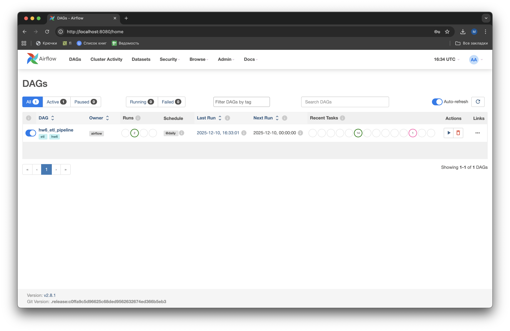
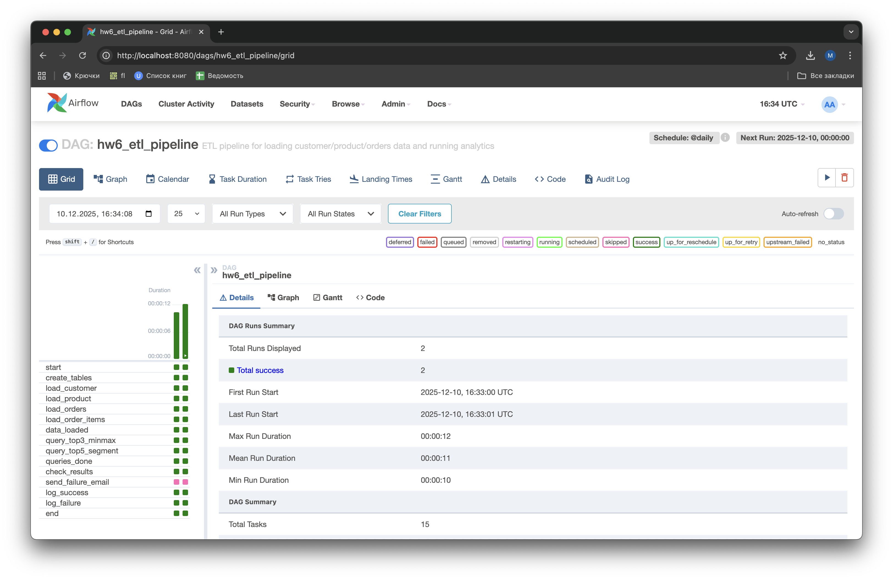
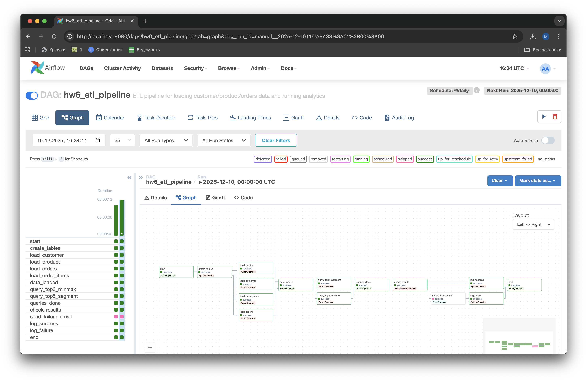
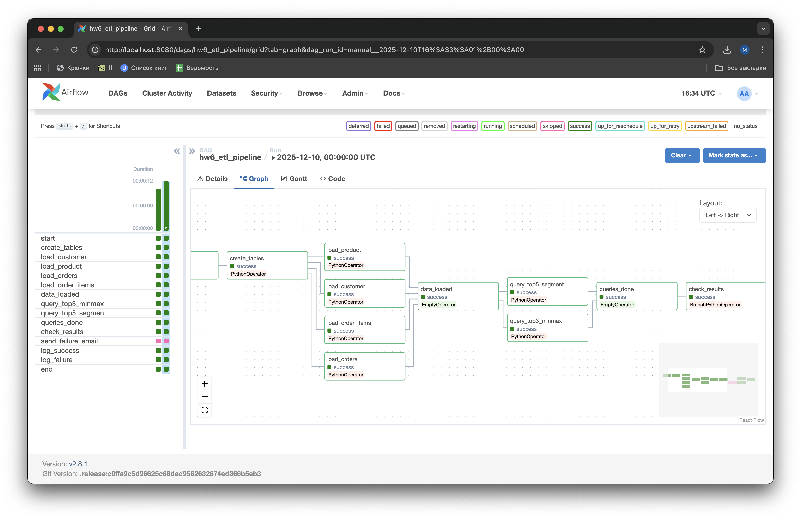

# Домашнее задание 6. Автоматизация расчетов с помощью Apache AirFlow

## Структура проекта

```
hw6/
├── dags/
│   ├── hw6_dag.py              # Airflow DAG (оркестрация)
│   └── hw6/                    # Пакет с модулями
│       ├── config.py           # Конфигурация
│       ├── sql/                # SQL-запросы
│       │   ├── schema.sql
│       │   ├── top3_minmax.sql
│       │   └── top5_segment.sql
│       └── tasks/              # Таски
│           ├── db.py           # Работа с БД
│           └── queries.py      # Выполнение запросов
├── data/
│   ├── customer.csv            # Данные о клиентах
│   ├── product.csv             # Данные о продуктах
│   ├── orders.csv              # Данные о заказах
│   └── order_items.csv         # Связь заказов и продуктов
├── output/                     # Результаты запросов
├── docker-compose.yaml         # Docker Compose для Airflow
├── Makefile                    # Удобные команды
└── README.md
```

## Запуск

1. Запустить Airflow:
```bash
make up
```

2. Добавить подключение к PostgreSQL:
```bash
make add-connection
```

3. Открыть веб-интерфейс: http://localhost:8080
   - Логин: `airflow`
   - Пароль: `airflow`

4. Активировать DAG:
```bash
make unpause
```

5. Запустить DAG вручную:
```bash
make trigger
```

## DAG: hw6_etl_pipeline

### Список DAG-ов



### Шаг 1: Загрузка данных (параллельно)
- `load_customer` - загрузка клиентов из customer.csv
- `load_product` - загрузка продуктов из product.csv
- `load_orders` - загрузка заказов из orders.csv
- `load_order_items` - загрузка позиций заказов из order_items.csv

### Шаг 2: Выполнение запросов (параллельно)
- `query_top3_minmax` - ТОП-3 минимальных и максимальных сумм транзакций
- `query_top5_segment` - ТОП-5 клиентов в каждом сегменте благосостояния

### Шаг 3: Проверка результатов
- Если запросы вернули 0 строк → отправка email-уведомления

### Шаг 4: Логирование результата
- `log_success` или `log_failure` в зависимости от результата

### Grid View (история запусков)



### Graph View (структура DAG)





## Результаты

После выполнения DAG результаты запросов сохраняются в директории `output/`:
- `top3_minmax.csv` - клиенты с ТОП-3 мин/макс суммами
- `top5_by_segment.csv` - ТОП-5 по сегментам благосостояния

## Полезные команды

```bash
make up              # Запустить Airflow
make down            # Остановить Airflow
make logs            # Посмотреть логи
make shell           # Открыть shell в контейнере
make trigger         # Запустить DAG
make status          # Статус выполнения
make clean           # Очистить всё (включая volumes)
```
